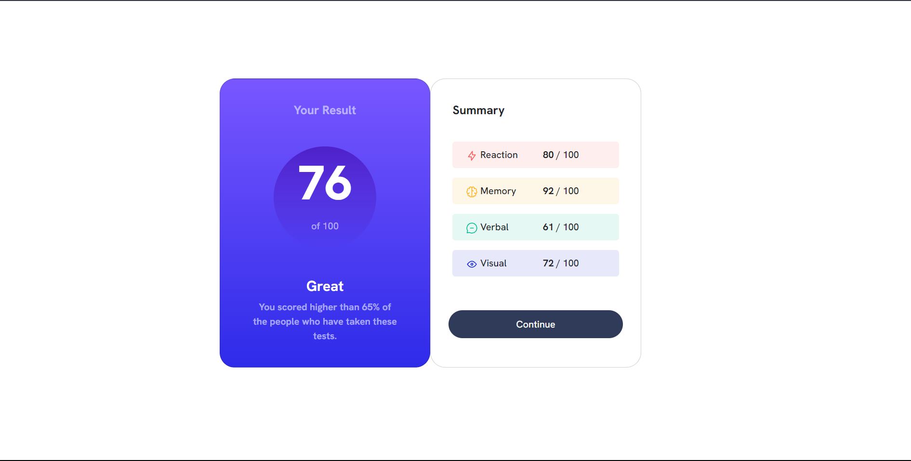

# Frontend Mentor - Results summary component solution

This is a solution to the [Results summary component challenge on Frontend Mentor](https://www.frontendmentor.io/challenges/results-summary-component-CE_K6s0maV).

## Table of contents

  - [The challenge](#the-challenge)
  - [Screenshot](#screenshot)
  - [Links](#links)
- [My process](#my-process)
  - [Built with](#built-with)
  - [Continued development](#continued-development)
  - [Useful resources](#useful-resources)
- [Author](#author)

### The challenge

Users should be able to:

- View the optimal layout for the interface depending on their device's screen size
- See hover and focus states for all interactive elements on the page

### Screenshot

### Links

- Solution URL: [Add solution URL here](https://your-solution-url.com)
- Live Site URL: [Add live site URL here](https://your-live-site-url.com)

## My process

### Built with

- Semantic HTML5 markup
- CSS custom properties
- Flexbox
- Bootstrap
- CSS Grid

### Continued development

I want to majorly focus on responsive site development and Backend development.

### Useful resources

      bootstrap(Grids): https://getbootstrap.com/docs/5.3/layout/grid/
      bootstrap(cards): https://getbootstrap.com/docs/5.3/components/card/

## Author

- Frontend Mentor - [@SsinghH-AaryanN](https://www.frontendmentor.io/profile/SsinghH-AaryanN)

